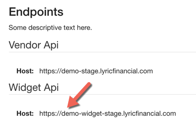

Once one of your clients is registered in the Lyric system, you can integrate the Lyric Widget into your website so when the client is logged in, they can see their Advance Limit, Current Balance and Available Balance.

### How to Use

**1) Create a Web Service Call that generates a JWT token**

The Lyric Widget makes a web service call to Lyric's APIs to get the Advance information.  In order to authenticate this call, you will need to provide a JWT token to the widget.  You can find more information on this [here](!Demo_Integration_Server/Token_Api).

**2) Call your new web service and get the newly generated token.**  

You can store this token in local storage if you'd like so you're not creating a new token every time the page is refreshed.

**3) Create an instance of Lyric Widget.**  

The constructor takes the vendorClientAccountId and the widget api host.  You can find your host by going to [Settings](/secure/settings/#/settings) and clicking on Endpoints.  

Then call loadData() on it passing the newly generated token.  loadData() returns a promise so in the .then you can then get the html of the widget to add to your web page.

    var lyricWidget;

    lyricWidget = new LyricWidget('abc', 'https://vendorId-widget-dev.lyricfinancial.com');

    lyricWidget.loadData(token).then(function() {
      var html;
      html = lyricWidget.getWidget();
      return document.getElementById('lyric-container').innerHtml = html;
    });

**4) Customize the lyric widget how you'd like.**

    .widget-label {
      font-weight: bold;
      float: left;
    }

    .widget-value {
      text-align: right;
    }

    .widget-container {
      border-style: solid;
      border-radius: 15px;
      border-color: #d01e1e;
      border-width: 1px;
      padding: 10px;
      width: 150px;

      font-size: 8px;
    }